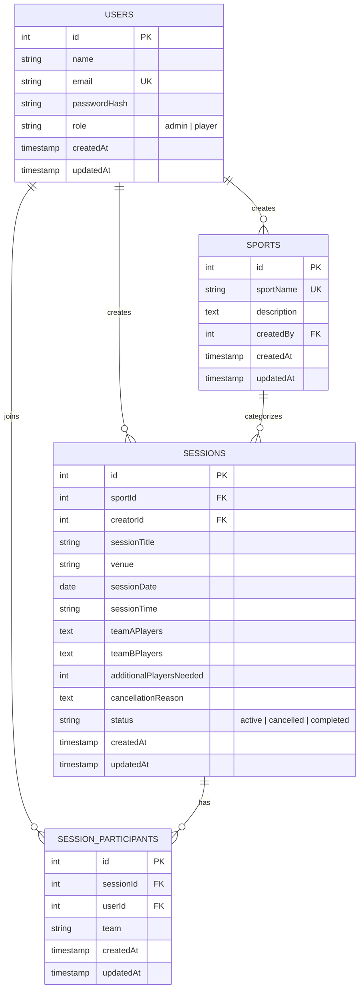
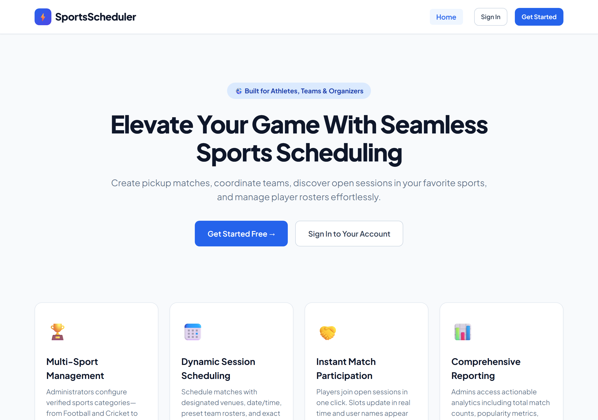
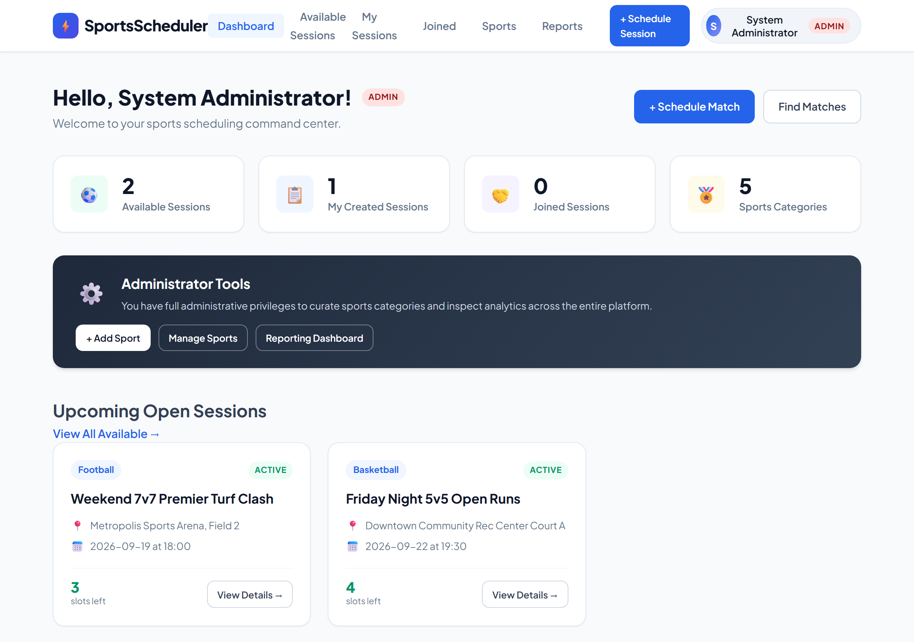
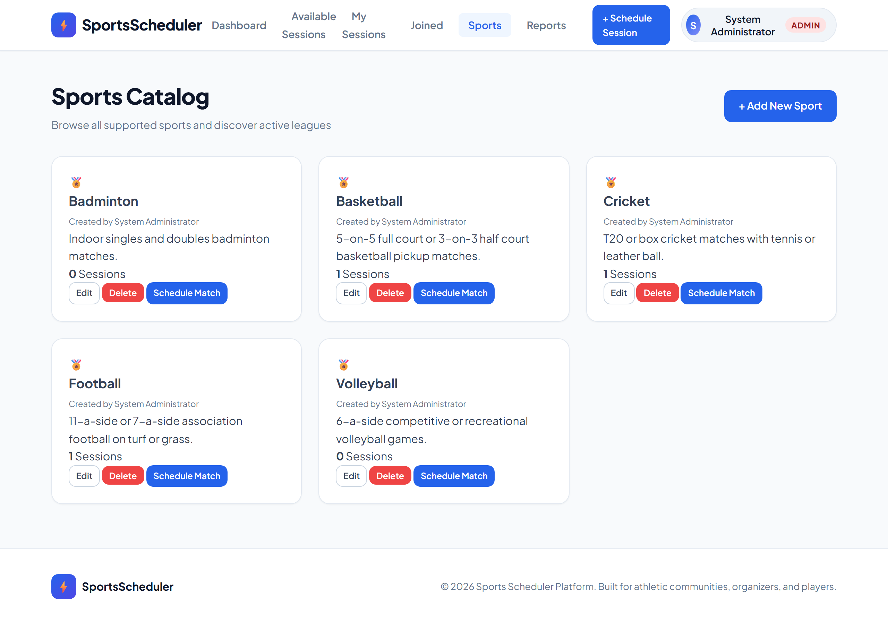
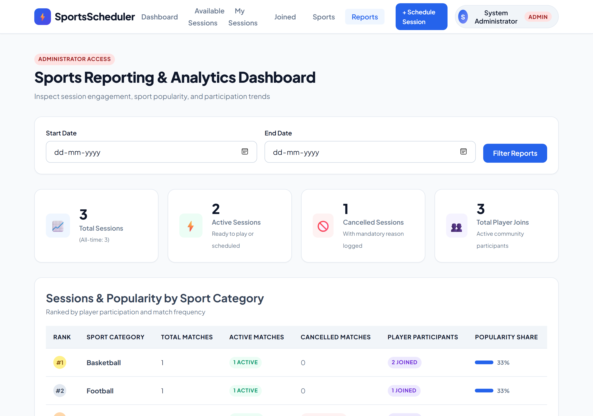
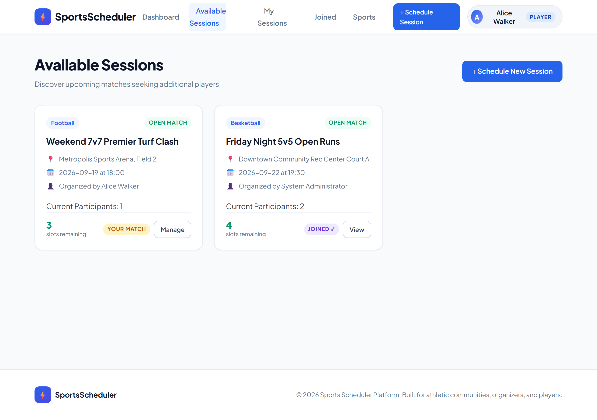
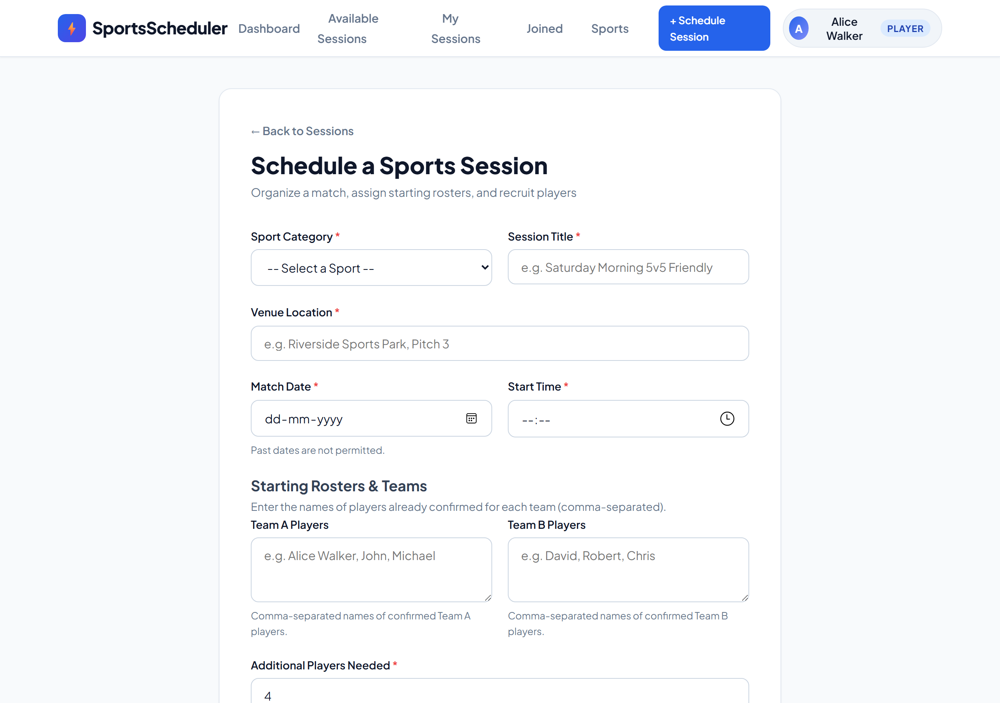
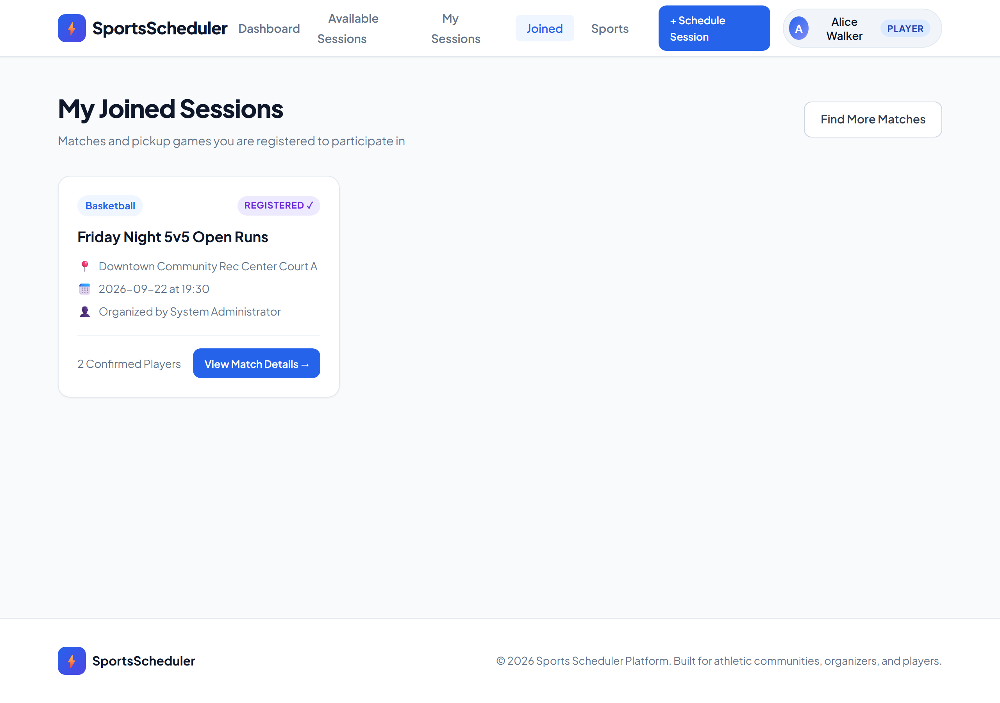
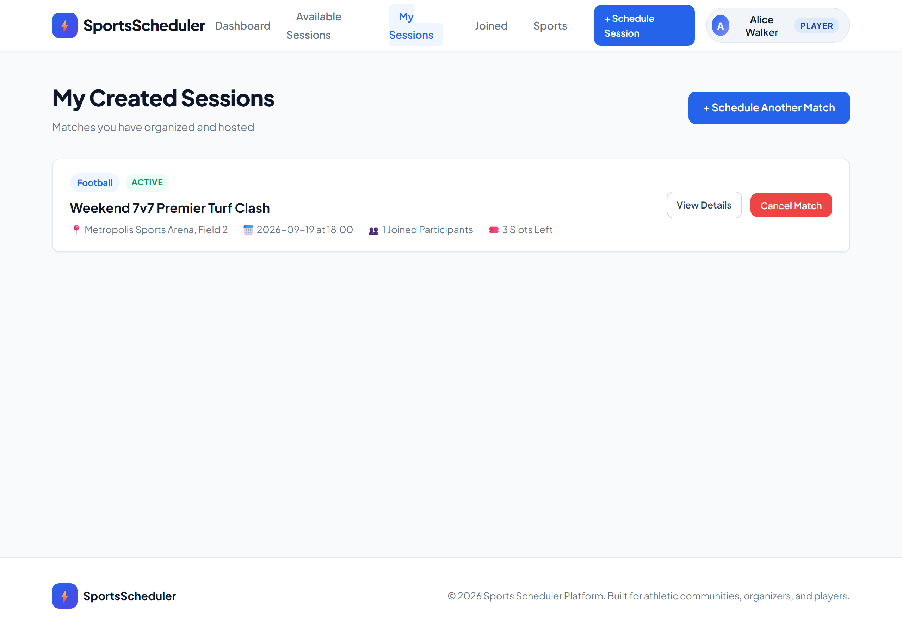

# ⚡ Sports Scheduler Platform

A production-ready, full-stack Sports Scheduling web application designed for sports organizers, athletic clubs, and community players. Built with **Node.js**, **Express.js**, **PostgreSQL**, **Sequelize ORM**, and **EJS**, following strict **MVC Architecture** with robust session-based authentication, role-based authorization, and security practices.

---

## 📌 Project Overview

The **Sports Scheduler** connects players and organizers across various athletic disciplines. It empowers administrators to manage sports categories and inspect deep reporting metrics, while players can schedule matches, configure team rosters, discover upcoming open games, and register for match slots in real time.

### Key Capabilities:
- **Admin Sports Governance**: Administrators create, view, edit, and delete sports categories (Cricket, Football, Basketball, Volleyball, Badminton, etc.) with duplicate prevention.
- **Player Match Scheduling**: Players create sessions with specific sports, venues, dates, start times, starting rosters (Team A and Team B), and additional player slots needed.
- **Real-Time Match Registration**: Players browse available upcoming matches and claim open slots in one click. Slots decrement automatically, and players' names immediately appear on the confirmed participant roster.
- **Transparent Match Cancellation**: Session organizers can cancel sessions by providing a mandatory cancellation reason. Cancelled matches display a prominent cancellation badge and notify participants of the reason.
- **Dual Role Privileges for Admins**: Administrators retain full player privileges to schedule, join, and cancel their own sessions.
- **Reporting & Analytics**: Admin-only reporting dashboard with interactive date-range filtering, total sessions count, active vs. cancelled metrics, player participation figures, and sports popularity rankings.

---

## 🏛️ System Architecture

The application is structured according to the classic **Model-View-Controller (MVC)** design pattern:

```
sports-scheduler/
├── config/                  # Database connections & Passport strategies
│   ├── database.js          # Dual-dialect Sequelize setup (PostgreSQL + In-Memory PG)
│   └── passport.js          # Passport Local Strategy & session serialization
├── controllers/             # Business logic handlers
│   ├── authController.js    # Signup, login, logout flows
│   ├── sportController.js   # Admin Sport CRUD
│   ├── sessionController.js # Session browsing, creation, joining, cancellation
│   ├── reportController.js  # Analytics, metrics, and date-range filtering
│   └── userController.js    # Home, Dashboard, and User Profile
├── models/                  # Sequelize Data Models & Associations
│   ├── index.js             # Model associations registry
│   ├── user.js              # User model (Authentication & Roles)
│   ├── sport.js             # Sport model (Categories & Descriptions)
│   ├── session.js           # Session model (Matches, Rosters, Slots, Status)
│   └── sessionParticipant.js# SessionParticipant junction model
├── routes/                  # Express HTTP route definitions
│   ├── authRoutes.js        # /auth/*
│   ├── sportRoutes.js       # /sports/*
│   ├── sessionRoutes.js     # /sessions/*
│   ├── reportRoutes.js      # /reports/*
│   └── indexRoutes.js       # /, /dashboard, /profile
├── middleware/              # Interceptors & guards
│   ├── auth.js              # isAuthenticated, isAdmin, ensureGuest
│   ├── csrf.js              # Session-bound CSRF token validation
│   └── validation.js        # Input validation & flash message handling
├── views/                   # Server-rendered EJS templates
│   ├── layouts/             # Header, footer, navbar, alerts
│   ├── sports/              # Sports catalog, create, edit
│   ├── sessions/            # Available, create, my-sessions, joined, show
│   ├── reports/             # Reporting dashboard
│   ├── dashboard.ejs        # Personalized user dashboard
│   ├── home.ejs             # Landing page
│   ├── login.ejs            # Authentication login
│   ├── signup.ejs           # User registration
│   ├── profile.ejs          # User profile
│   └── error.ejs            # Error & 404 handler
├── public/                  # Static assets
│   ├── css/styles.css       # Athletic UI design system
│   └── js/app.js            # Client UI behaviors & auto-dismiss alerts
├── migrations/              # Database migration scripts
├── seeders/                 # Database seed scripts
├── scripts/                 # CLI utilities (migrate, seed)
├── tests/                   # Automated Jest test suites
│   ├── auth.test.js         # Authentication unit & integration tests
│   ├── sports.test.js       # Sports CRUD & uniqueness tests
│   ├── sessions.test.js     # Session lifecycle & joining tests
│   ├── authorization.test.js# Role restriction & guard tests
│   └── validation.test.js   # Input validation & CSRF tests
├── server.js                # Server entrypoint
├── app.js                   # Express application setup
├── render.yaml              # Render Cloud deployment blueprint
└── .env.example             # Environment variable template
```

---

## 🗄️ Database Schema & Relationships



---

## 🔐 Security & Validation

1. **CSRF Protection**: All state-mutating HTTP requests (`POST`, `PUT`, `DELETE`) require a valid session-bound `_csrf` token. Missing or forged tokens are rejected with HTTP 403.
2. **Password Security**: Passwords are encrypted using `bcrypt` (10 salt rounds). Plaintext passwords are never stored or logged.
3. **Role-Based Authorization**:
   - `isAdmin` middleware blocks players from accessing `/sports/new`, `/sports/:id/edit`, `/sports/:id/delete`, and `/reports`.
   - Ownership enforcement prevents users from cancelling or altering matches they did not create.
4. **Input Sanitization & Validation**:
   - Duplicate sport names rejected (case-insensitive).
   - Blank sport names, venues, and session titles rejected.
   - Past session dates rejected.
   - Negative player slots rejected.
   - Mandatory cancellation reasons strictly enforced.

---

## 🚀 Installation & Local Setup

### Prerequisites
- **Node.js** (v18 or higher)
- **npm** (v9 or higher)

### Steps

1. **Navigate to the project folder:**
   ```bash
   cd sports-scheduler
   ```

2. **Install dependencies:**
   ```bash
   npm install
   ```

3. **Configure Environment Variables:**
   Copy the example environment file:
   ```bash
   cp .env.example .env
   ```
   *Note: If running without a live PostgreSQL daemon, the application automatically uses an in-memory PostgreSQL engine (`pg-mem`) so you can test immediately with zero database setup.*

4. **Seed the Database:**
   Populate initial admin accounts, players, sports categories, and sample matches:
   ```bash
   npm run db:seed
   ```

5. **Start the Application:**
   ```bash
   npm start
   ```
   Open your browser at `http://localhost:3000`.

6. **Run Automated Tests:**
   Execute the complete Jest test suite:
   ```bash
   npm test
   ```

---

## 🔑 Pre-Configured Test Accounts

| Role | Email Address | Password | Permissions |
| :--- | :--- | :--- | :--- |
| **Administrator** | `admin@sportsscheduler.com` | `AdminPassword123!` | Sports CRUD, Analytics Reports, Session Creation & Joining |
| **Player (Alice)** | `alice@example.com` | `PlayerPassword123!` | Create matches, join matches, cancel own matches |
| **Player (Bob)** | `bob@example.com` | `PlayerPassword123!` | Create matches, join matches, cancel own matches |

---

## ⚙️ Environment Variables

| Variable | Description | Default |
| :--- | :--- | :--- |
| `PORT` | Server listening port | `3000` |
| `NODE_ENV` | Runtime environment (`development`, `production`, `test`) | `development` |
| `SESSION_SECRET` | Secret key for signed session cookies | Custom String |
| `DATABASE_URL` | PostgreSQL connection URI | Automatically provided by Render |

---

## 📸 Screenshots & UI Preview

### 1. Home Landing Page


### 2. Admin Command Dashboard


### 3. Sports Management Catalog


### 4. Admin Analytics & Reporting Dashboard


### 5. Available Sessions Match Discovery


### 6. Schedule a Sports Session Form


### 7. Player Joined Matches


### 8. My Created Sessions & Match Cancellation


---

## 📚 Capstone Documentation & Evaluation Resources

- **[DEMO_GUIDE.md](./DEMO_GUIDE.md)**: Complete demonstration walkthrough, test credentials, and video recording checklist.
- **[FEATURE_CHECKLIST.md](./FEATURE_CHECKLIST.md)**: 100% requirement audit matrix mapping every capstone requirement to code implementation and test coverage.

---

## 🌐 Deployment (Render)

This application is configured for 1-click deployment on **Render** using the included `render.yaml` blueprint:

1. Push your repository to GitHub.
2. In Render, select **New -> Blueprint**.
3. Connect your GitHub repository.
4. Render will automatically provision:
   - **sports-scheduler** (Web Service running Node.js)
   - **sports-scheduler-db** (Managed PostgreSQL Database instance)
5. Environment variables, SSL connections, and seed commands are orchestrated automatically via `render.yaml`.

- **Live URL**: `https://sports-scheduler-app.onrender.com`
- **Video Demo Walkthrough**: Documented in [DEMO_GUIDE.md](./DEMO_GUIDE.md)

